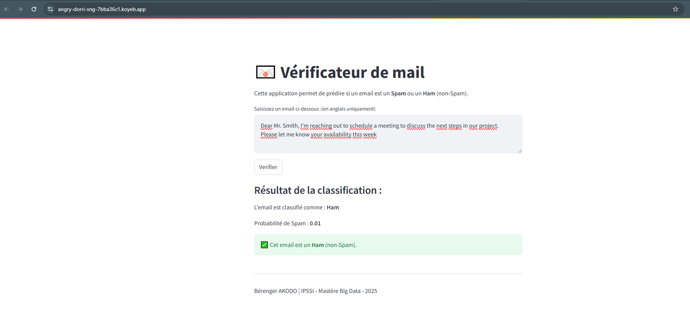

# Spam-Ham Email Classifier with MLP

## Description

Ce projet implémente un classificateur **Spam-Ham** utilisant un **Multi-Layer Perceptron (MLP)** pour prédire si un email est un **spam** ou un **ham**. L'application utilise **Streamlit** pour une interface interactive permettant de tester le modèle en temps réel.

### Dataset
Le dataset provient de Kaggle et contient des emails classifiés en **Spam** et **Ham**.

**Lien du dataset**: [Spam-Ham Email Dataset](https://www.kaggle.com/datasets/meruvulikith/190k-spam-ham-email-dataset-for-classification)

## Fonctionnalités
- Entraînement d'un modèle MLP pour la classification des emails.
- Sauvegarde du modèle et du vectorizer.
- Application Streamlit pour tester le modèle.

## **interface**
Voici une représentation visuelle de l'interface Streamlit :



## **Installation et Déploiement**
1. Clonez le dépôt :
   ```bash
   git clone https://github.com/Berenger2/mlp_spam_ham_email.git
   cd mlp_spam_ham_email
